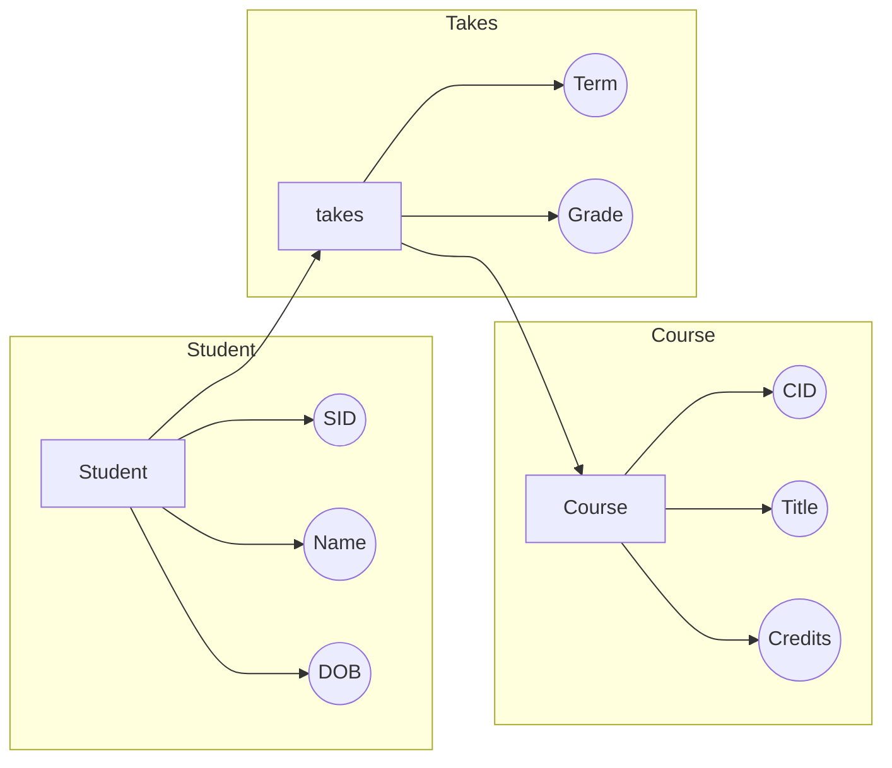

### an entity set attributes

- attributes:
    - can be composite
    - can be multivalued
    - are always underscored

### Relationship sets
- there is a student entity and it has SID, name, and dob as attributes. 
- the table has three attributes

- lets say there is a course entity and it has CID, title, and credits as attributes.


| SID | Name | DOB |       
|-----|------|-----|
| 123   | Jay    |    |

<br>

| CID | Title | Credits |
|-----|-------|---------|
| EECS 101 | Intro to CS | 4 |


<br>

- connecting those two tables, we have a relationship set called "takes" which connects the student and course entity.
- in that relation we have two attributes, term and grade. 

| SID | CID | Term | Grade |
|-----|-----|------|-------|
| 123 | EECS 101 | Fall 2024 | A |


- the relationship set works as a bridge that connects two entities and the attributes that they share and have specific attributes for those relates to the 

<br><br>



<br>
<br>
<br>


```mermaid
graph LR;
    subgraph Employee
        A[Employee]
        D((EID))
        E((Name))
        F((DOB))
        A --> D
        A --> E
        A --> F
    end