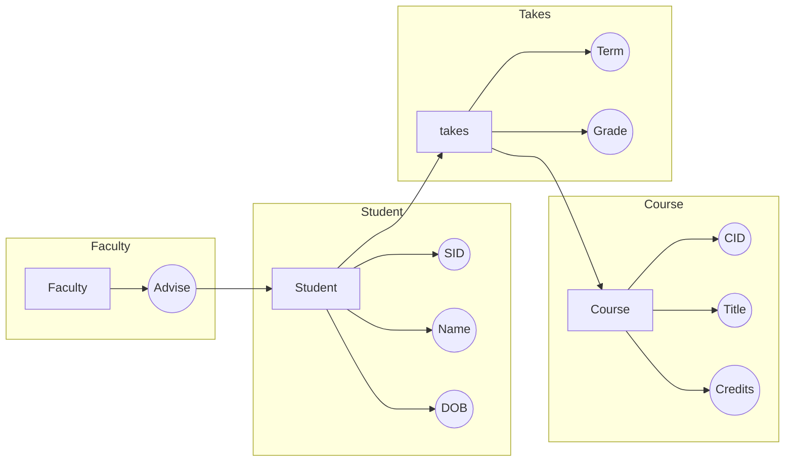
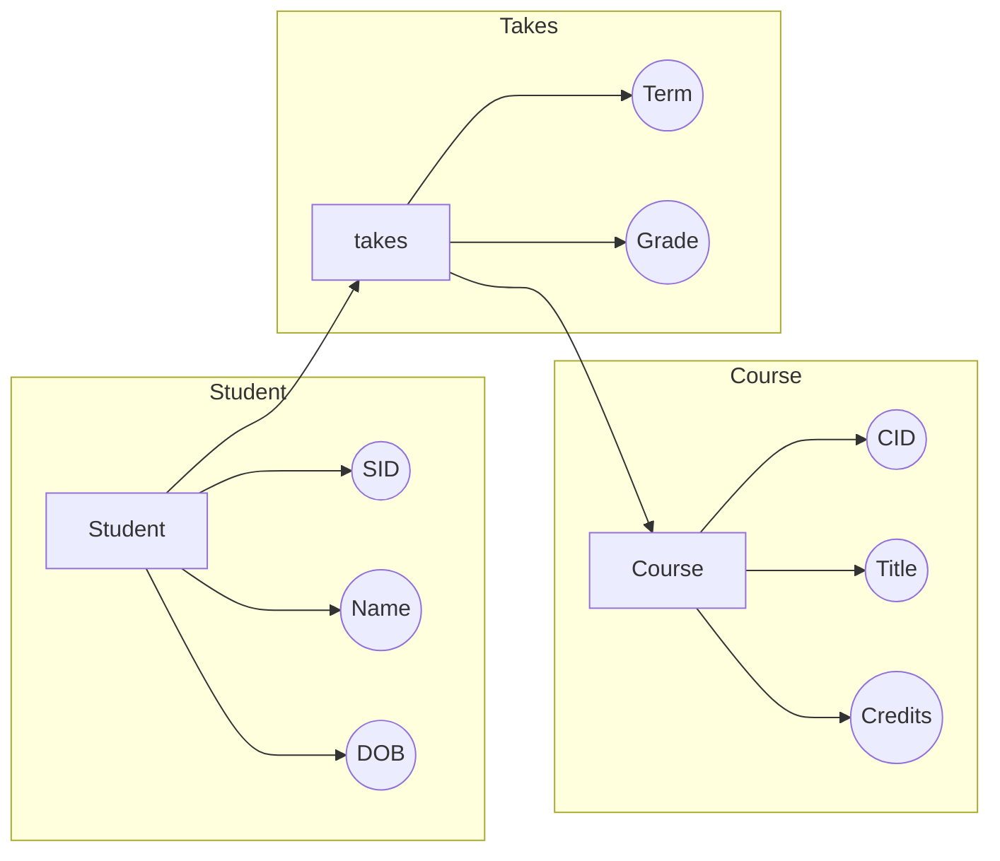

# Conceptual modeling

```mermaid
graph LR;

    subgraph Faculty
        Z[Faculty]
        Y((Advise))
    end


    subgraph Student
        A[Student]
        D((SID))
        E((Name))
        F((DOB))
    end

    subgraph Course
        C[Course]
        G((CID))
        H((Title))
        I((Credits))
    end

    subgraph Takes
        B[takes]
        J((Term))
        K((Grade))
    end

    A --> B --> C
    A --> D
    A --> E
    A --> F
    C --> G
    C --> H
    C --> I
    B --> J
    B --> K
    Z --> Y
    Y --> A
```

## Ternary Relationship

- a relationship between three entities

- Example: a relationship between student, course, and instructor

```mermaid
graph LR;
    subgraph Student
        A[Student]
        D((SID))
        E((Name))
        F((DOB))
    end

    subgraph Course
        C[Course]
        G((CID))
        H((Title))
        I((Credits))
    end

    subgraph Takes
        B[takes]
        J((Term))
        K((Grade))
    end

    A --> B --> C
    A --> D
    A --> E
    A --> F
    C --> G
    C --> H
    C --> I
    B --> J
    B --> K
```

