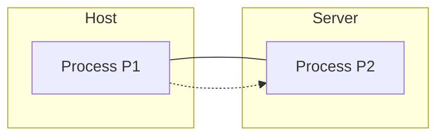

# Internet Transport Services

- TCP: Transmission Control Protocol
- UDP: User Datagram Protocol

## TCP

- Let's say we have a host and a server. The transportation layer is end-to-end connected with each other, so the process P1 is communicating with P2.

- **Connection-oriented**: There should be some sort of mutual role that when you attach your packets onto the rope, they should also be able to receive it. It requires a setup between the sender and the receiver.

- **Reliable packet transport**: Everything is delivered in order, and there are no losses of packets.
- **Flow control**: The sender won't overwhelm the receiver.
- **Congestion control**: The sender won't overwhelm the network.
- **No guarantees for delay and throughput**.

## UDP

- **Connectionless**: There is no connection between the sender and the receiver.

- **Unreliable data transport**: There is no guarantee that the packets will be delivered.
- Doesn't provide: **reliability, timing, throughput guarantees, security, or connection setup**.
- It is designed for applications that are based on short packets. For example, **DNS**.
- **Quick and dirty**.
- Doesnt ensure that the packets are delivered in order.

- But why **UDP**?
    - it doenst require a setup like TCP and it is faster. 

## HTTP
- **Hypertext Transfer Protocol**: It is an web application layer protocol.

- Utilizes client server model
    - client: the one who requests the data
    - server: the one who provides the data
- Uses TCP as its transport protocol
    - intitate the connection with the server
    - the server should be able to receive the request.
    - server can decline the request
    - once the connection is established, the client can send the request to the server and the server can send the response back to the client.
    - After the response is sent, the connection is closed by HTTP server.
    - the client gets the response.
    - For each object, this process is repeated.
    - This is called **non-persistent HTTP**.
- **Persistent HTTP**: The connection is kept alive after the response is sent. The client can send multiple requests to the server without closing the connection.
- The client communicates with the server that for how long it will need their service.

- For non-persistent HTTP response time = 2RTT + file transmission tim (i.e. tranmission delay)
- For persistent HTTP response time = RTT + file transmission time
- what is the costing of these connections? does it matter?