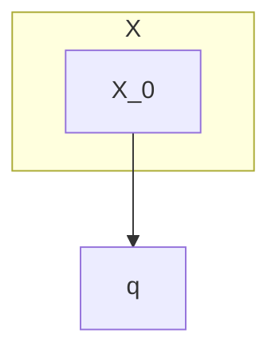

# Statistical attack

## original formula

- string = N length
- feq = frequency of letter a in string S
- probablity (two sampling are both a)

$$

\frac{f_a}{N} \cdot \frac{f_a - 1}{N - 1} = \frac{f_a \cdot (f_a - 1)}{N \cdot (N - 1)}
$$
$$
\sum_{i=a}^{N} \frac{f_i \cdot (f_i - 1)}{N \cdot (N - 1)}
$$

## Cryptogrphaic hash functions

- pre image resistance
- second pre image resistance
- collision resistance

- we dont want to see that two different inputs have the same outputs. 

## Bruteforce attacks on hash functions

- a circle of X_0 inside a cirlce of X. pointing towards another circle with text q values inside it.

- if the attacker wants to break the hash function, they would have to use the power of q = 2^127 to break the hash function that has 128 bits.